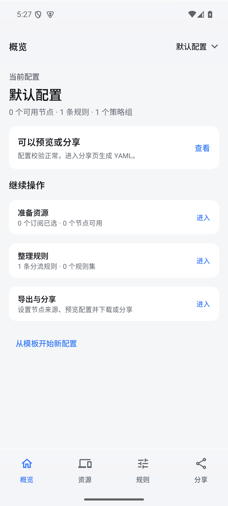
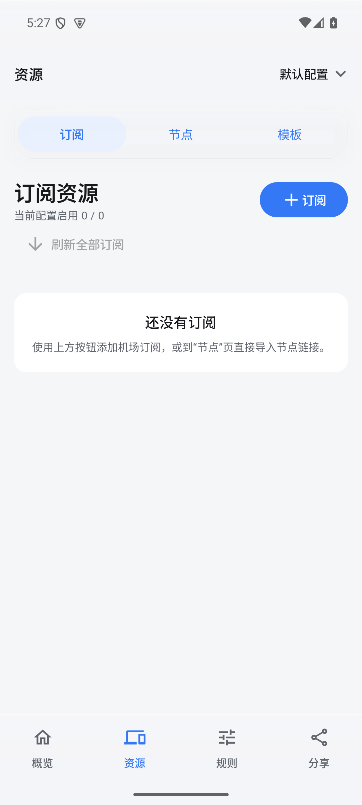
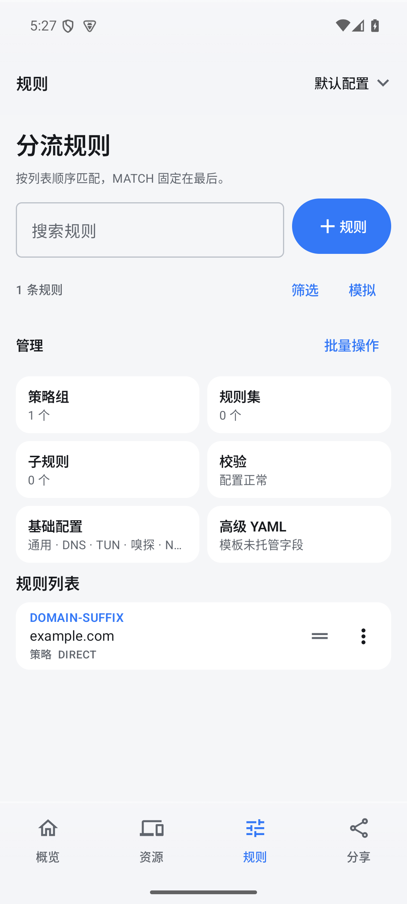
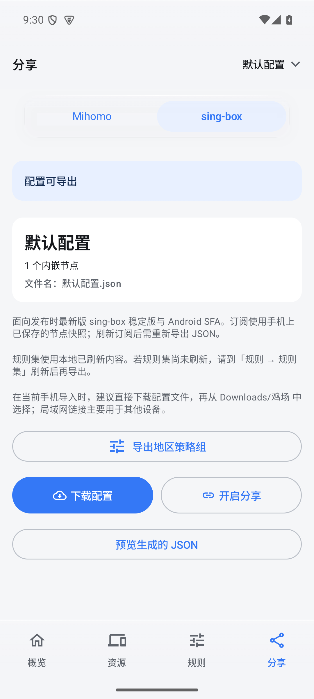

# 鸡场

在手机上整理节点、订阅和分流规则，生成 **Mihomo YAML** 或面向最新版稳定版 **sing-box / SFA** 的 JSON 配置。

**[下载 Android APK](https://github.com/2020743996/jichang/releases/latest)** · 支持 Android 13 及以上

## 主要功能

- **资源管理**：添加订阅、导入节点链接或扫码导入，保存和复用配置模板。
- **规则编辑**：管理分流规则、策略组、规则集与子规则；支持搜索、排序、批量操作和配置校验。
- **双格式导出**：Mihomo 保留模板、高级 YAML 和订阅引用；sing-box 将当前已保存的节点与规则集快照转换为 JSON。
- **明确校验**：sing-box 无法等价转换的节点参数、规则或规则集会显示位置并阻止导出，不会悄悄丢失配置。
- **分享配置**：预览、下载 YAML／JSON，或在局域网内通过链接和二维码分享。

## 界面

| 概览 | 资源 | 规则 | 分享 |
| :--: | :--: | :--: | :--: |
|  |  |  |  |

## 快速上手

1. 在「资源」添加订阅、节点或模板。
2. 在「规则」调整分流规则并检查配置。
3. 在「分享」选择 Mihomo 或 sing-box，再预览、下载或开启局域网分享。

## sing-box / SFA

在「分享」选择 sing-box 后下载 `.json` 文件，再从官方 [SFA Android 客户端](https://sing-box.sagernet.org/clients/android/)导入。导出使用本机已保存的订阅节点和已刷新的 YAML／文本规则集；更新订阅或规则集后，需要重新导出。MRS、Geo 数据、子规则及无法等价转换的高级字段会显示为阻断项。

当前版本按官方 [sing-box 1.14.2](https://github.com/SagerNet/sing-box/releases/tag/v1.14.2) 与对应 SFA 验证。此后每次鸡场发布都以当时最新的稳定版适配和验证，不提供旧版配置兼容分支；sing-box 后续格式变化需要鸡场更新。

鸡场负责生成配置，不内置代理内核或 VPN。扫码导入时会向系统申请相机权限。

项目采用 [MIT 许可证](LICENSE)。
