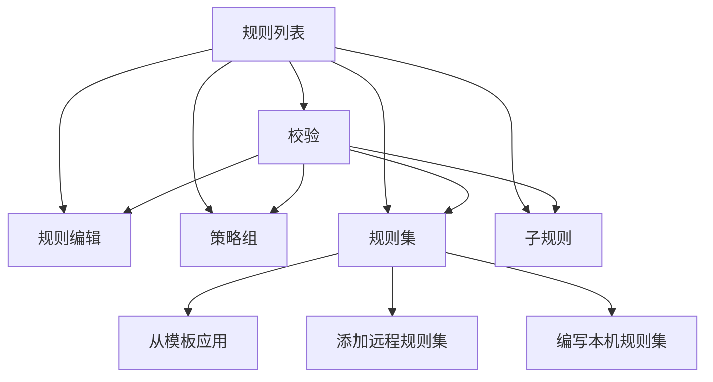

# 鸡场 App 页面与操作流程

## 主导航

底部固定四个入口：**概览、资源、规则、分享**。当前配置选择器保留在顶栏。进入规则管理详情或 YAML 预览时，顶栏提供返回入口，底部导航暂时隐藏；系统返回先回到所属页面，再从其他主页面回到概览。

| 入口 | 主要内容 | 下一步 |
| --- | --- | --- |
| 概览 | 当前配置、可用节点数、规则状态 | 直接进入资源、规则或分享；校验问题直达校验页 |
| 资源 | 订阅、节点、模板 | 添加或整理资源；从模板新建配置后进入规则 |
| 规则 | 单一规则列表、搜索、按需展开的筛选、批量操作 | 从入口卡片进入策略组、规则集、子规则和校验 |
| 分享 | 导出状态、节点来源、模板订阅绑定、下载及局域网分享 | 独立页面预览 YAML；规则错误直达校验页 |

## 规则管理

规则只有一份列表。规则类型、匹配内容和目标策略始终可编辑；组合条件与其他参数在同一编辑页展开。规则按原始列表顺序执行，MATCH 固定最后。搜索或筛选期间暂停排序，清除条件后恢复拖动与上下移动。批量更改目标或删除需要先进入选择状态。规则集按来源筛选，不再以来源拆成多层页面。

## 日常流程

1. 在**资源**添加订阅、节点或模板，并为当前配置选择可用节点。
2. 在**规则**添加和排序路由规则，按需管理策略组、规则集与子规则；从校验页修正错误。
3. 在**分享**检查导出状态与节点来源，按需绑定模板订阅并预览 YAML，然后下载或开启局域网分享。

分享页的规则错误会阻止下载和开启分享，并提供到校验页的入口。引用订阅地址时仍显示凭据提示；局域网分享开启后显示二维码、链接和停止入口。配置、节点和规则数据的归属方式，以及生成的 Mihomo YAML 规则保持不变。
