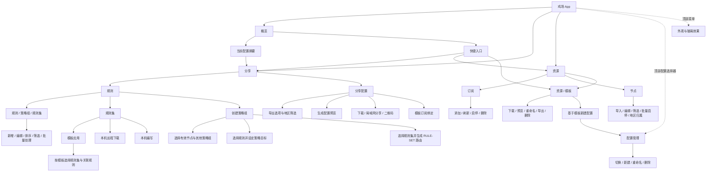

# 鸡场 App UI 与操作流程

依据当前 Android 客户端页面整理，用于梳理功能结构、主要入口和用户操作路径。

## UI 页面结构



## 常用操作主流程

```mermaid
flowchart TD
    Start([开始]) --> Choose{选择任务}

    Choose -->|准备资源| Resources[资源]
    Resources --> Source[订阅：添加或刷新]
    Source --> Parsed[解析并保存节点]
    Resources --> Node[节点：导入或整理节点]
    Parsed --> Select[选择当前配置使用的订阅与节点]
    Node --> Select
    Select --> Rules[分享 / 规则]

    Choose -->|配置分流| Rules
    Rules --> EditRules[编辑规则、策略组或规则集]
    EditRules --> Validate[检查规则目标、引用与顺序]
    Validate -->|有问题| EditRules
    Validate -->|通过| Export[分享 / 分享配置]

    Choose -->|从模板开始| Templates[资源 / 模板]
    Templates --> Download[输入 HTTP(S) 链接并下载 YAML]
    Download --> SaveTemplate[解析后保存到本机模板库]
    SaveTemplate --> NewProfile[基于模板新建配置]
    NewProfile --> Bind[按需绑定模板中的订阅]
    Bind --> Export

    Export --> Options[选择内嵌节点或引用订阅，并设置地区筛选]
    Options --> Generate[生成 Mihomo YAML]
    Generate --> Check{模板订阅已绑定且配置有效？}
    Check -->|否| Fix[返回绑定订阅或修正规则]
    Fix --> Export
    Check -->|是| Preview[查看配置预览]
    Preview --> Delivery{选择输出方式}
    Delivery -->|保存文件| DownloadFile[下载 YAML]
    Delivery -->|局域网传输| StartShare[开启分享并展示链接 / 二维码]
    StartShare --> StopShare[完成后停止分享]

    EditRules -. 相同条件指向不同策略时提示 .-> Validate
```

## 页面与功能清单

| 入口 | 子页面 / 区域 | 主要能力 |
| --- | --- | --- |
| 概览 | 当前配置、统计卡片、快捷入口 | 查看当前配置状态，跳转到规则、订阅、节点、模板 |
| 分享 | 规则 | 管理路由规则、策略组、规则集和子规则；导入模板规则集；提示明显冲突并校验配置 |
| 分享 | 分享配置 | 配置导出方式和地区筛选；预览、下载 YAML；启动或停止局域网分享 |
| 资源 | 订阅 | 添加 HTTP(S) 订阅，刷新、启停、删除；订阅节点共享到各配置 |
| 资源 | 节点 | 导入、搜索、筛选、编辑、批量启停和调整地区归属 |
| 资源 | 模板 | 下载并本地保存 YAML；预览、导出、重命名、删除；据此新建配置 |
| 规则 | 规则集 | 从配置模板应用规则集和关联规则；本机缓存远程规则集；编写内嵌规则集 |
| 顶部配置选择器 | 配置管理 | 切换配置；新建、重命名或删除配置 |
| 顶部菜单 | 外观与玻璃效果 | 调整应用外观 |

## 梳理时可继续补充

- 每个操作的前置条件、成功反馈、失败反馈和空状态。
- 哪些数据属于共享资源，哪些数据按当前配置独立保存。
- 删除、导出含订阅凭据、开启局域网分享等需要确认的节点。
- 新用户首次打开 App 的引导路径和推荐完成顺序。
